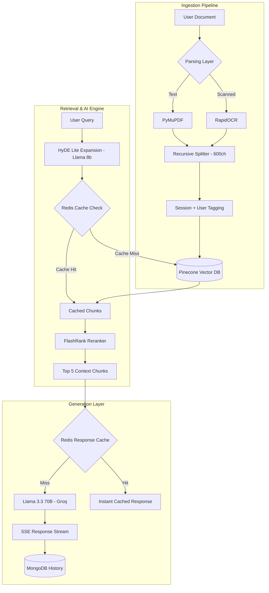

# 🚀 RAG Premium v3.0 — AI Retrieval System

  
  
  
  
  
  

  <b>⚡ Ultra-fast • 🧠 Intelligent • 🛰️ Observable • 💼 Production Ready</b>

---

## 🌟 Overview

RAG Premium v3.0 is a **production-grade Retrieval-Augmented Generation (RAG) system** designed for:

- ⚡ Low latency  
- 🎯 High accuracy  
- 📈 Scalability  
- 🧠 Intelligent query understanding  

---

## 🏗️ Technical Architecture

---

## 🦾 Core Infrastructure

### 🧠 Multi-Model Pipeline
- **Embeddings:** `all-MiniLM-L6-v2` — Fast semantic encoding.
- **Optimizer:** `Llama 3.1 8B` — HyDE-Lite expansion for form fields.
- **Reranker:** `ms-marco-MiniLM-L-12-v2` — Local cross-encoding relevance filter.
- **Generator:** `Llama 3.3 70B` (Groq) — Context-governed answer synthesis.

### ⚡ Production Caching (Redis)
The system implements **Context-Aware Caching** to minimize LLM costs and maximize speed:
- **Optimization Cache**: Stores expanded queries to avoid redundant LLM calls.
- **Semantic Cache**: Stores retrieved Pinecone chunks for 20 minutes.
- **Response Cache**: Uses SHA-256 context hashing to serve verified answers instantly for recurring questions.

---

## 🔄 Workflow

### 📥 Ingestion Pipeline
1.  **Fast Hand-off**: Synchronous upload confirms file receipt immediately.
2.  **Structural Chunking**: Text split into **600-character** blocks to preserve form-field integrity.
3.  **Strict Isolation**: Chunks tagged with `session_id` to prevent across-chat data leakage.

### 🔍 Retrieval Pipeline
1.  **Intent Mapping**: User queries are expanded with regional and technical synonyms.
2.  **Cache Verification**: Redis checks for previously processed semantic results.
3.  **Isolated Search**: Retrieval strictly filtered by `user_id` and `session_id`.

### 🧠 Generation Pipeline
1.  **Context Sovereignity**: Guardrails strictly limit the AI to provided context.
2.  **Safe Fallback**: If no high-confidence data exists, the AI triggers the "Ambiguity Protocol" and asks you for clarification.

---

## ✨ Enterprise Features

- 🧬 **Multi-Session Isolation**: Total privacy between conversations.
- 📌 **Smart Workspace**: Search, Pin, and Rename conversations.
- 🛡️ **Guest Sandbox**: Strict 1-chat limit for anonymous users.
- 📁 **File Safety**: 10MB limit + Cancel Upload support.
- 🛰️ **Live Observability**: Real-time status for Redis, Pinecone, and LLM throughput.
